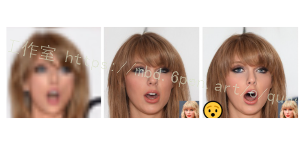
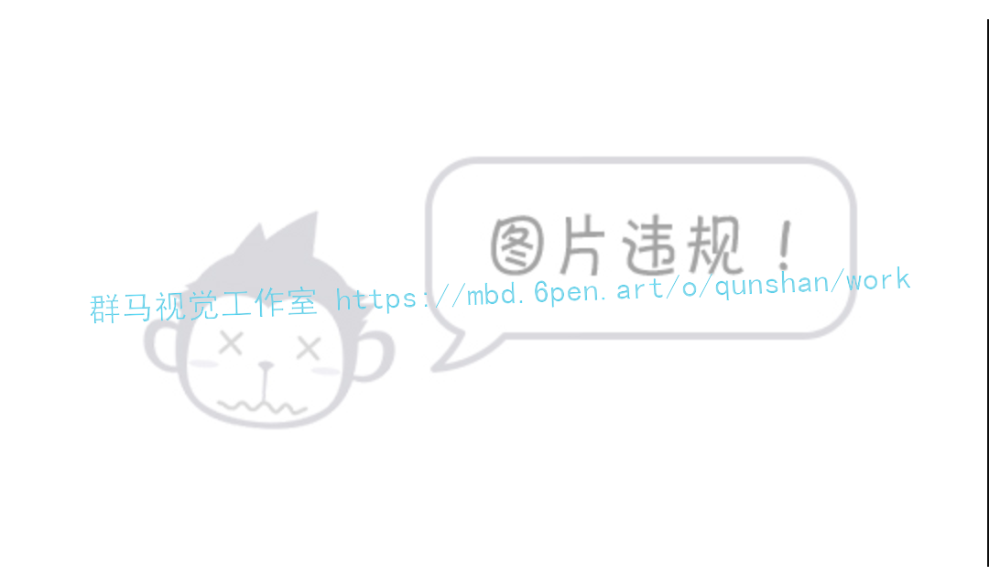
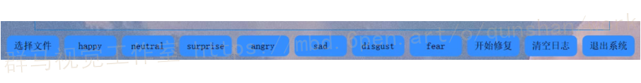
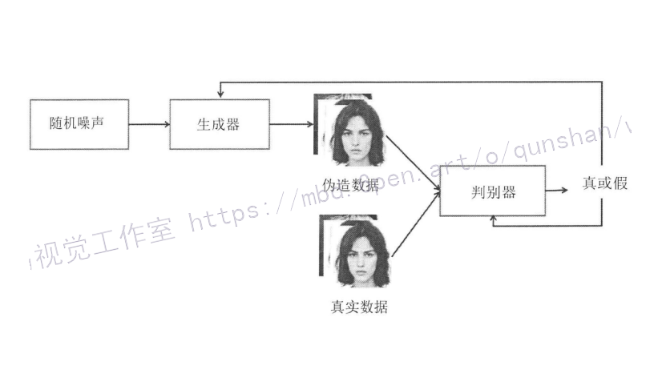
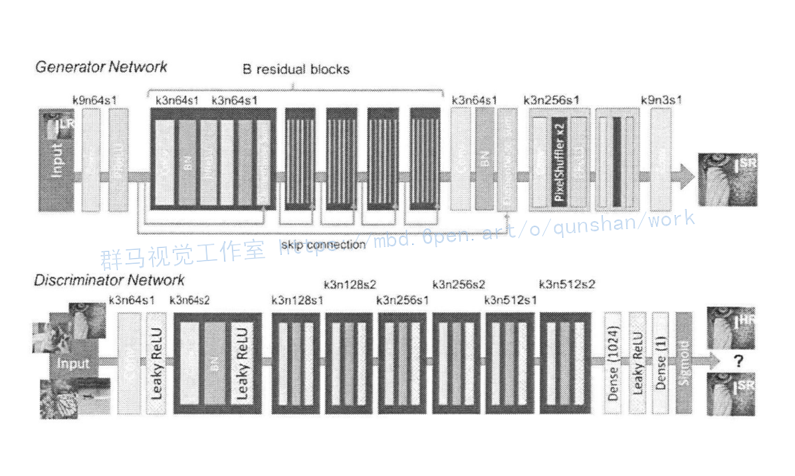
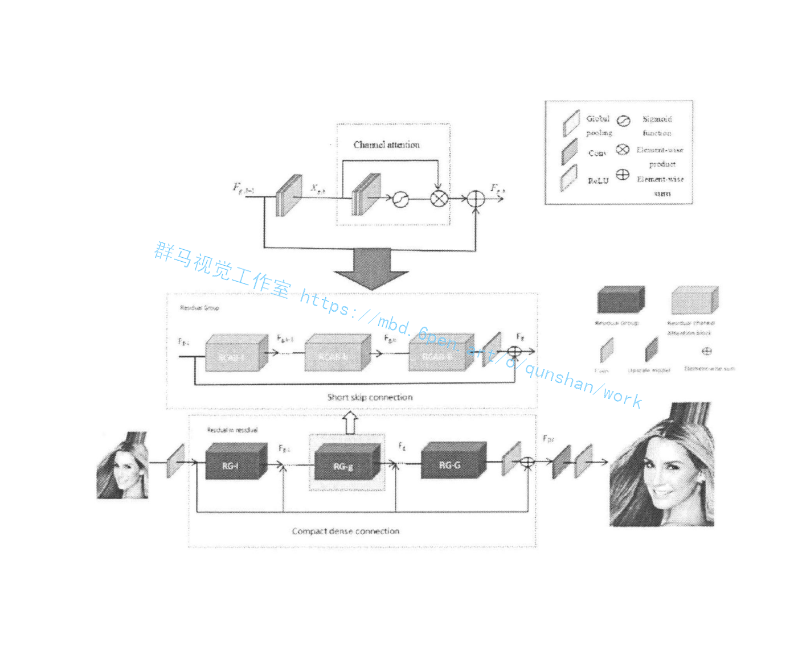
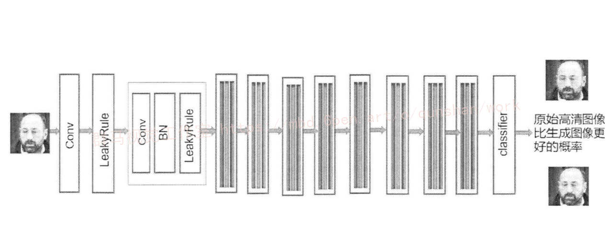

# 1.研究背景

对于图像恢复，大多数现有的基于深度学习的方法在遇到训练假设之外的未观察到的退化时，往往会超出训练数据，从而导致糟糕的结果。为了提高鲁棒性，提出了基于生成性对抗网络（GAN）先验的方法，显示了恢复照片级真实感和高质量结果的良好能力。但这些方法存在语义混乱，特别是在语义上有意义的图像，如人脸图像上。本文提出了一种语义感知的图像恢复潜在空间探索方法（SAIR）。通过对引用的语义信息进行显式建模，SAIR可以一致地将严重退化的图像恢复到高分辨率、高逼真的外观，还可以纠正语义。定量和定性实验共同证明了拟议SAIR的有效性。

# 2.图片演示






## 可选择超分辨率人脸表情修复方向



# 3.生成对抗网络

生成对抗网络(Generative Adversarial Networks，GAN)以数据生成为主要目标，其网络模型是通过一对神经网络“生成器”(Generator)和“判别器”(Discriminator)构成，如图所示。DCGAN[48]首次在LSUN[A9]和Celeb Al50J数据集上实现了图像生成，将卷积神经网络用于特征提取和反卷积网络进行生成图像的放大;LSGANI51模型聚焦目标函数，以最小二乘损失、Wasserstein[52]距离等方法代替了交叉嫡损失，解决了生成对抗网络训练不稳定、模型难以收敛、生成图像多样性差等问题;Big GANl53]等模型通过利用多种网络优化策略、庞大的参数量和出色的算力可以生成清晰且人眼难以辨识的自然图像;Cycle GANl54]等模型将GAN应用至图像风格迁移等领域。


# 4.SRGAN
得益于生成对抗网络在超分辨率重建任务中具有提高图像感知质量的优势，SRGAN[S6]在进行人脸图像重建时丰富了图像的细节纹理，显著地提升了重建图像的质量,使其更符合观察者的感知。SRGAN利用感知损失(perceptualloss)和对抗损失(adversarial loss)来提升恢复出的图片的真实感。其模型结构如图所示。


# 5.生成网络结构的改进

首先，本文对生成网络的主干部分进行改进。主要是通过文献阅读和实验研究，对 SRGAN中的生成器进行改进，其核心方法是采用基于通道注意力机制的残差密集块(Residual channel attention blocks,RCAB)代替SRGAN的基础块，RCAB是由残差块(RB)和通道注意力机制(CA)组成。其中，每一个残差组(Residual in residual, RIR)包含G个残差块(Residual groups, RG)和长跳跃连接(Long skip connections, LSC)，每个残差块包含B个RCAB。经实验结果表明，采用这种残差结构可以训练非常深的CNN，而不会出现梯度消失现象，特征提取的高频信息也不会缺失，能够更好的重建人脸图像，提高整个网络模型的性能。由于低分辨率人脸图像的输入中包含着丰富的人脸特征信息，超分辨率重建网络特征提取的目的是恢复出更多有用的信息，通过基于身份的长跳跃连接，可以绕过丰富的低频信息，对人脸的高频信息进行处理，从而提升重建效果。为了进一步学习高频特征，本文在每个残差组中引入通道注意力，构成整体网络模型结构。其结构如图所示:


# 6.判别网络结构的改进

在标准生成对抗网络中，判别网络的作用是用来判断输入的数据是否真实。使用标准生成对抗网络中的判别器时，模型训练效果通常会产生误差。主要原因是，在生成对抗网络的训练过程中，判别器会将生成器生成的伪造数据判别为假。然而，人脸图像数据通过神经网络高迭代次数的训练，生成器生成的超分辨率图像与真实的人脸图像十分接近，这导致最终判别器将生成数据和真实数据均认定为真实数据，此结论与判别器输入一半数据为伪造数据的先验知识不符。如果在提高伪造数据的真实性的同时不降低真实数据为真的可能性，标准生成对抗网络将完全忽略先验知识，除非采用正则化或较低的学习率，否则判别器将不会做出合理的预测结果。为解决判别网络带来的模型训练不稳定问题，本文采用相对平均判别器来代替标准GAN中的判别器。相对平均判别器[64]是用来预测平均给定的真实数据比假数据更真实的概率。为了使生成对抗网络能够在提高伪造数据的可能性的同时降低真实数据的可能性，将判别器由判定“数据是真实的可能性”修改为判定“真实数据相比伪造数据更真实的可能性”。经实验表明，本文采用相对平均判别器进行网络模型训练，得到的网络模型性能更优，重建的人脸图像质量更高。根据相对判别器原理，其网络结构如图所示。



# 7.代码实现
```
import torch
import dataset
import os
import argparse
from torch.utils.data import DataLoader
import models
import time
import matplotlib.pyplot as plt
import loss


class Trainer:
    record = {"train_loss_d": [], "train_loss_g": [], "train_psnr": [], "val_loss": [], "val_psnr": []}
    x_epoch = []

    def __init__(self, args):
        self.args = args
        self.device = self.args.device
        self.gnet = models.Generator()
        self.dnet = models.Discriminator()
        batch = self.args.batch
        self.train_loader = DataLoader(dataset.SRGANDataset(self.args.data_path, "train"),
                                       batch_size=batch, shuffle=True, drop_last=True)
        self.val_loader = DataLoader(dataset.SRGANDataset(self.args.data_path, "val"),
                                     batch_size=batch, shuffle=False, drop_last=True)
        self.criterion_g = loss.PerceptualLoss(self.device)
        self.regularization = loss.RegularizationLoss()
        self.criterion_d = torch.nn.BCELoss()
        self.epoch = 0
        self.lr = 1e-3
        self.best_psnr = 0.
        if self.args.resume:
            if not os.path.exists(self.args.save_path):
                print("No params, start training...")
            else:
                param_dict = torch.load(self.args.save_path)
                self.epoch = param_dict["epoch"]
                self.lr = param_dict["lr"]
                self.dnet.load_state_dict(param_dict["dnet_dict"])
                self.gnet.load_state_dict(param_dict["gnet_dict"])
                self.best_psnr = param_dict["best_psnr"]
                print("Loaded params from {}\n[Epoch]: {}   [lr]: {}    [best_psnr]: {}".format(self.args.save_path,
                                                                                                self.epoch, self.lr,
                                                                                                self.best_psnr))
        self.dnet.to(self.device)
        self.gnet.to(self.device)
        self.optimizer_d = torch.optim.Adam(self.dnet.parameters(), lr=self.lr)
        self.optimizer_g = torch.optim.Adam(self.gnet.parameters(), lr=self.lr*0.1)
        self.real_label = torch.ones([batch, 1, 1, 1]).to(self.device)
        self.fake_label = torch.zeros([batch, 1, 1, 1]).to(self.device)

    @staticmethod
    def calculate_psnr(img1, img2):
        return 10. * torch.log10(1. / torch.mean((img1 - img2) ** 2))

    def train(self, epoch):
        self.dnet.train()
        self.gnet.train()
        train_loss_d = 0.
        train_loss_g = 0.
        train_loss_all_d = 0.
        train_loss_all_g = 0.
        psnr = 0.
        total = 0
        start = time.time()
        print("Start epoch: {}".format(epoch))
        for i, (img, label) in enumerate(self.train_loader):
            img = img.to(self.device)
            label = label.to(self.device)
            fake_img = self.gnet(img)
            loss_g = self.criterion_g(fake_img, label, self.dnet(fake_img)) + 2e-8*self.regularization(fake_img)
            self.optimizer_g.zero_grad()
            loss_g.backward()
            self.optimizer_g.step()
            if i % 2 == 0:
                real_out = self.dnet(label)
                fake_out = self.dnet(fake_img.detach())
                loss_d = self.criterion_d(real_out, self.real_label
                                          ) + self.criterion_d(fake_out, self.fake_label)
                self.optimizer_d.zero_grad()
                loss_d.backward()
                self.optimizer_d.step()

                train_loss_d += loss_d.item()
                train_loss_all_d += loss_d.item()
            train_loss_g += loss_g.item()
            train_loss_all_g += loss_g.item()
            psnr += self.calculate_psnr(fake_img, label).item()
            total += 1

            if (i+1) % self.args.interval == 0:
                end = time.time()
                print("[Epoch]: {}[Progress: {:.1f}%]time:{:.2f} dnet_loss:{:.5f} gnet_loss:{:.5f} psnr:{:.4f}".format(
                    epoch, (i+1)*100/len(self.train_loader), end-start,
                    train_loss_d/self.args.interval,
                    train_loss_g/self.args.interval, psnr/total
                ))
                train_loss_d = 0.
                train_loss_g = 0.
        print("Save params to {}".format(self.args.save_path1))
        param_dict = {
            "epoch": epoch,
            "lr": self.lr,
            "best_psnr": self.best_psnr,
            "dnet_dict": self.dnet.state_dict(),
            "gnet_dict": self.gnet.state_dict()
        }
        torch.save(param_dict, self.args.save_path)
        return train_loss_all_d/len(self.train_loader), train_loss_all_g/len(self.train_loader), psnr/total

    def val(self, epoch):
        self.gnet.eval()
        self.dnet.eval()
        print("Test start...")
        val_loss = 0.
        psnr = 0.
        total = 0
        start = time.time()
        with torch.no_grad():
            for i, (img, label) in enumerate(self.train_loader):
                img = img.to(self.device)
                label = label.to(self.device)
                fake_img = self.gnet(img).clamp(0.0, 1.0)
                loss = self.criterion_g(fake_img, label, self.dnet(fake_img))
                val_loss += loss.item()
                psnr += self.calculate_psnr(fake_img, label).item()
                total += 1

            mpsnr = psnr / total
            end = time.time()
            print("Test finished!")
            print("[Epoch]: {} time:{:.2f} loss:{:.5f} psnr:{:.4f}".format(
                epoch, end - start, val_loss / len(self.val_loader), mpsnr
            ))
            if mpsnr > self.best_psnr:
                self.best_psnr = mpsnr
                print("Save params to {}".format(self.args.save_path))
                param_dict = {
                    "epoch": epoch,
                    "lr": self.lr,
                    "best_psnr": self.best_psnr,
                    "gnet_dict": self.gnet.state_dict(),
                    "dnet_dict": self.dnet.state_dict()
                }
                torch.save(param_dict, self.args.save_path1)
        return val_loss/len(self.val_loader), mpsnr

    def draw_curve(self, fig, epoch, train_loss_d, train_loss_g, train_psnr, val_loss, val_psnr):
        ax0 = fig.add_subplot(121, title="loss")
        ax1 = fig.add_subplot(122, title="psnr")
        self.record["train_loss_d"].append(train_loss_d)
        self.record["train_loss_g"].append(train_loss_g)
        self.record["train_psnr"].append(train_psnr)
        self.record["val_loss"].append(val_loss)
        self.record["val_psnr"].append(val_psnr)
        self.x_epoch.append(epoch)
        ax0.plot(self.x_epoch, self.record["train_loss_d"], "bo-", label="train_d")
        ax0.plot(self.x_epoch, self.record["train_loss_g"], "go-", label="train_g")
        ax0.plot(self.x_epoch, self.record["val_loss"], "ro-", label="val_g")
        ax1.plot(self.x_epoch, self.record["train_psnr"], "bo-", label="train")
        ax1.plot(self.x_epoch, self.record["val_psnr"], "ro-", label="val")
        if epoch == 0:
            ax0.legend()
            ax1.legend()
        fig.savefig(r"./train_fig/train_{}.jpg".format(epoch))

    def lr_update(self):
        for param_group in self.optimizer_d.param_groups:
            param_group['lr'] = self.lr * 0.1
        self.lr = self.optimizer_d.param_groups[0]["lr"]
        for param_group in self.optimizer_g.param_groups:
            param_group['lr'] = self.lr
        print("===============================================")
        print("Learning rate has adjusted to {}".format(self.lr))


def main(args):
    t = Trainer(args)
    fig = plt.figure()
    for epoch in range(t.epoch, t.epoch + args.num_epochs):
        train_loss_d, train_loss_g, train_psnr = t.train(epoch)
        val_loss, val_psnr = t.val(epoch)
        t.draw_curve(fig, epoch, train_loss_d, train_loss_g, train_psnr, val_loss, val_psnr)
        # if (epoch + 1) % 10 == 0:
        #     t.lr_update()


if __name__ == '__main__':
    parser = argparse.ArgumentParser(description="Training SRGAN with celebA")
    parser.add_argument("--device", default="cuda", type=str)
    parser.add_argument("--data_path", default=r"T:\srgan", type=str)
    parser.add_argument("--resume", default=False, type=bool)
    parser.add_argument("--num_epochs", default=100, type=int)
    parser.add_argument("--save_path", default=r"./weight01.pt", type=str)
    parser.add_argument("--save_path1", default=r"./weight00.pt", type=str)
    parser.add_argument("--interval", default=20, type=int)
    parser.add_argument("--batch", default=8, type=int)
    args1 = parser.parse_args()
    main(args1)

```

# 8.系统整合


# 9.完整源码＆环境部署视频教程＆自定义UI界面
[Python基于GAN的低分辨率人脸修复超分辨率系统（源码＆教程） (mianbaoduo.com)](https://mbd.pub/o/bread/mbd-Y5iVkplp)


# 10.参考文献
[1]王威,张彤,王新.用于图像超分辨率重构的深度学习方法综述[J].小型微型计算机系统.2019,(9).1891-1896.DOI:10.3969/j.issn.1000-1220.2019.09.015.
[2]姜杰,刘哲,吕林涛.局部线性嵌入的快速单幅图像超分辨率技术[J].红外技术.2018,(1).39-46.
[3]徐志刚,李文文,朱红蕾,等.一种基于L1/2正则约束的超分辨率重建算法[J].华中科技大学学报（自然科学版）.2017,(6).38-42.DOI:10.13245/j.hust.170608.
[4]张新.图像处理中超分辨率与修复方法的研究[D].2018
[5]姚烨.高分辨率视频卫星影像超分辨率重建技术研究[D].2018
[6]Chao Dong,Chen Change Loy,Kaiming He,等.Image Super-Resolution Using Deep Convolutional Networks[J].IEEE Transactions on Pattern Analysis & Machine Intelligence.2015,38(2).295-307.

---
#### 如果您需要更详细的【源码和环境部署教程】，除了通过【系统整合】小节的链接获取之外，还可以通过邮箱以下途径获取:
#### 1.请先在GitHub上为该项目点赞（Star），编辑一封邮件，附上点赞的截图、项目的中文描述概述（About）以及您的用途需求，发送到我们的邮箱
#### sharecode@yeah.net
#### 2.我们收到邮件后会定期根据邮件的接收顺序将【完整源码和环境部署教程】发送到您的邮箱。
#### 【免责声明】本文来源于用户投稿，如果侵犯任何第三方的合法权益，可通过邮箱联系删除。